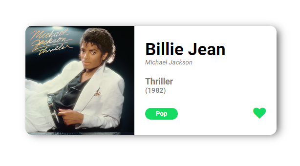
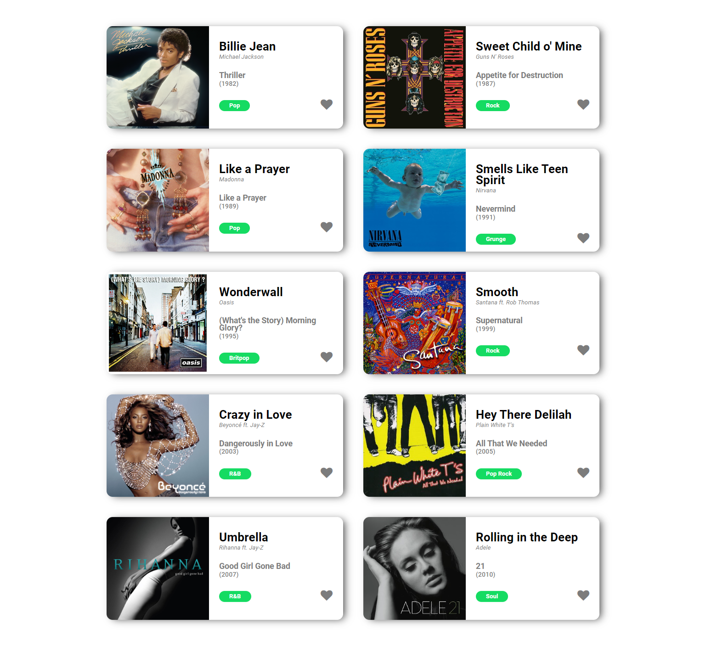

# Make It Real - Music Album

This is a solution to the React Music Album project of the Make It Real course.

## Table of contents

- [Overview](#overview)
  - [The challenge](#the-challenge)
  - [Screenshot](#screenshot)
- [My process](#my-process)
  - [Built with](#built-with)
  - [What I learned](#what-i-learned)
  - [Continued development](#continued-development)
  - [Useful resources](#useful-resources)
- [Author](#author)
- [Acknowledgments](#acknowledgments)


## Overview

### The challenge

Build a React.js card for a music album that can be liked.

### Screenshot






## My process

### Built with

- Semantic HTML5 markup
- CSS custom properties
- Flexbox
- React.js

### What I learned

I learned how to handle events and manage states in React.js.


```jsx
const [like, setlike] = useState(liked);

    const handleLike = () => {
        setlike(!like);
    };
```
```jsx
<div className={like ? "card__heart--liked" : "card__heart"}>
  <i onClick={handleLike} className="fa fa-heart"></i>
</div>
```

### Continued development

First step: Single Card

Second step: Render multiple cards.

## Author

Daniel Hincapié Vargas